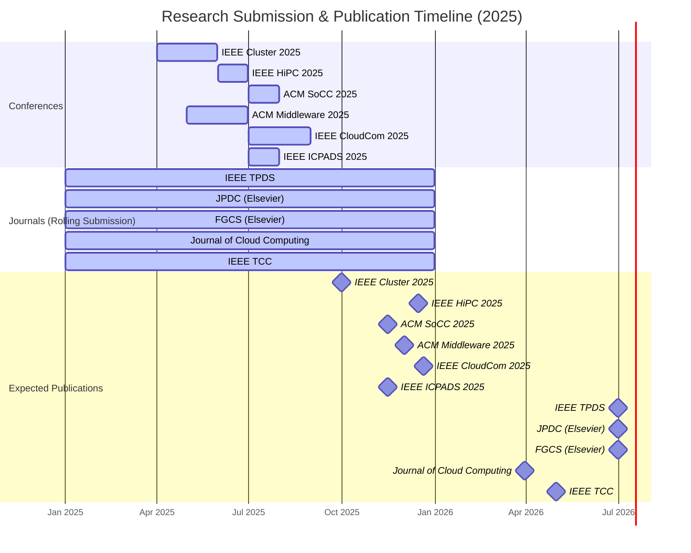
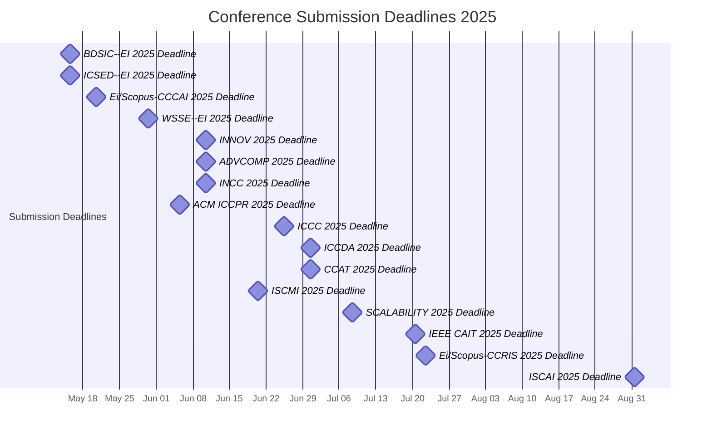

Got it! I'll find relevant journals and conferences in high-performance computing, cloud computing, disaggregated systems, and scheduling/optimization that are open for submission around May-August. I'll also prioritize open-access options but include high-impact alternatives. I'll update you with a list of options, deadlines, and submission requirements shortly.

## Conferences (May–August 2025 Deadlines)

**IEEE Cluster 2025 (Int’l Conference on Cluster Computing)** – *Top IEEE conference on cluster/HPC systems.*  

- **Impact Factor:** N/A (conference; CORE A-ranked). Published in IEEE Xplore (subscription-based).  
- **Submission Deadline:** *Expected* April–May 2025 (Cluster 2024 was extended to May 9 ([Call for Papers::Cluster 2024](https://clustercomp.org/2024/papers/#:~:text=,AoE))). Conference in Fall 2025.  
- **Topics:** All aspects of cluster and high-performance computing, including resource management and **job scheduling in disaggregated systems** ([Call for Papers::Cluster 2024](https://clustercomp.org/2024/papers/#:~:text=%2A%20Cluster%20system,Administration%2C%20monitoring%20and%20maintenance%20tools)), cluster architectures, cloud integration, etc.  
- **Guidelines:** Full papers max **10 pages**, IEEE 2-column format (10-pt) ([Call for Papers::Cluster 2024](https://clustercomp.org/2024/papers/#:~:text=,the%20double%20blind%20review%20policy)), **double-blind** peer review. Use IEEE template; submit via online system ([Call for Papers::Cluster 2024](https://clustercomp.org/2024/papers/#:~:text=,the%20double%20blind%20review%20policy)).
- **Link:** [IEEE Cluster 2025](http://www.wikicfp.com/cfp/servlet/event.showcfp?eventid=185495&copyownerid=191181)

**IEEE HiPC 2025 (Int’l Conf. on High Performance Computing, Data & Analytics)** – *Esteemed IEEE conference (31+ years) for HPC.*  

- **Impact Factor:** N/A (conference; CORE B). Proceedings in IEEE Xplore (not OA).  
- **Submission Deadline:** *Anticipated* June 2025 (HiPC 2024 full papers due June 26 ([HiPC 2024 Call for Papers](https://www.acm.org/articles/acm-india-bulletins/2024/hipc-2024-call-for-papers#:~:text=Important%20Deadlines))). Conference Dec 2025.  
- **Topics:** **High-performance computing systems and algorithms**, HPC applications, big data analytics, and resource management. Includes parallel algorithms, load balancing and **scheduling techniques** for HPC clusters ([HiPC 2024: IEEE International Conference on High Performance Computing, Data, and Analytics](https://www.myhuiban.com/conference/339?lang=en_us#:~:text=New%20parallel%20and%20distributed%20algorithms,numerical%20linear%20algebra)).  
- **Guidelines:** Typical IEEE conference format (double-column, ~10–12 pages). **Double-blind** review; submit via Linklings ([HiPC 2024 Call for Papers](https://www.acm.org/articles/acm-india-bulletins/2024/hipc-2024-call-for-papers#:~:text=Submit%20your%20paper%3A%20%20https%3A%2F%2Fssl)). Final papers published in proceedings; selected papers invited to JPDC special issue ([HiPC 2024 Call for Papers](https://www.acm.org/articles/acm-india-bulletins/2024/hipc-2024-call-for-papers#:~:text=Up%20to%20two%20best%20paper,JPDC)).

**ACM SoCC 2025 (Symposium on Cloud Computing)** – *Premier ACM conference on cloud systems (SIGMOD/SIGOPS co-sponsored).*  

- **Impact Factor:** N/A (CORE A). Not OA by default (ACM Digital Library).  
- **Submission Deadline:** ~ **July 2025** (SoCC 2024 deadline was July 8, 2024 ([SOCC 2024: ACM Symposium on Cloud Computing](https://myhuiban.com/conference/35?lang=en_us#:~:text=Submission%20Date%3A))). Conference likely Nov 2025.  
- **Topics:** All cloud computing aspects – e.g. data center architecture, distributed systems, edge/fog, security, cloud applications. Strong focus on **resource management, allocation, and scheduling** in cloud platforms ([2024 ACM Symposium on Cloud Computing](https://acmsocc.org/2024/papers.html#:~:text=,Virtualization%2C%20containers%2C%20and%20virtual%20machines)). Bridges academic and industry cloud R&D ([2024 ACM Symposium on Cloud Computing](https://acmsocc.org/2024/papers.html#:~:text=The%20annual%20ACM%20Symposium%20on,SIGOPS)).  
- **Guidelines:** **Full papers 12 pages** (ACM double-column + unlimited refs) ([2024 ACM Symposium on Cloud Computing](https://acmsocc.org/2024/papers.html#:~:text=Authors%20can%20submit%20a%20paper,one%20of%20the%20following%20categories)); short papers 6 pages. Reviews are double-blind (anonymized submissions) – arXiv preprints allowed with care ([2024 ACM Symposium on Cloud Computing](https://acmsocc.org/2024/papers.html#:~:text=Prior%20or%20concurrent%20publication%20in,any%20used%20in%20such%20contexts)). Use ACM SIGCONF template; submit via HotCRP.

**ACM/IFIP Middleware 2025 (International Middleware Conference)** – *Major forum for distributed systems “middleware” research.*  

- **Impact Factor:** N/A (conference; CORE A). Published by ACM (ACM DL; hybrid access).  
- **Submission Deadline:** **Multiple cycles** likely (e.g. an early 2025 round and another in **May–June 2025**). For 2024, an initial CFP deadline was Dec 1, 2023 ([List of Middleware Conferences | Upcoming Events Near Me](https://www.resurchify.com/e/conference/middleware/all-countries/all-years/page/1/#:~:text=%28Preliminary%20CFP%29,Dec%206%2C%202024%20Submission)); expect a mid-2025 round. Conference Dec 2025.  
- **Topics:** Design, implementation, and evaluation of middleware for distributed and cloud systems. Themes include cloud/datacenter middleware, **virtualization, auto-scaling, provisioning and scheduling** ([Middleware 2023](https://middleware-conf.github.io/2023/#:~:text=,time%20systems)), resource disaggregation, IoT/edge, security, etc.  
- **Guidelines:** **Double-blind** ACM submission. Typically ~14 pages in ACM two-column format (incl. references). Use the ACM SIGPLAN template (as in prior years). Submit via conference site. Papers appear in ACM DL; open-access available via author purchase or preprint.
- **Link:** [ACM Middleware 2025](http://www.wikicfp.com/cfp/servlet/event.showcfp?eventid=182685&copyownerid=11001)

**IEEE CloudCom 2025 (Intl. Conf. on Cloud Computing Technology & Science)** – *Established IEEE conference on cloud and emerging computing tech.*  

- **Impact Factor:** N/A (conference). IEEE Computer Society proceedings (Xplore; not OA by default ([CFP](https://easychair.org/cfp/cloudcom2024#:~:text=Publication))).  
- **Submission Deadline:** *Expected* **July/Aug 2025** (initial). CloudCom 2024 regular papers were due July 19, extended to Sept 6 ([CFP](https://easychair.org/cfp/cloudcom2024#:~:text=,October%2025%2C%202024)). The 2025 deadline may similarly extend into August. Conference Dec 2025.  
- **Topics:** Broad cloud computing research – cloud architectures, virtualization, cloud services, edge computing, big data, security. Includes some HPC-in-cloud topics ([CFP](https://easychair.org/cfp/cloudcom2024#:~:text=CloudCom%20is%20a%20premier%20international,edge%20innovations%2C%20and%20identify%20emerging)). **Scheduling and resource allocation in cloud/edge environments** are typical subtopics (e.g. multi-objective scheduling on cloud platforms ([Future Generation Computer Systems Multi-objective Scheduling of ...](https://www.semanticscholar.org/paper/Future-Generation-Computer-Systems-(-)-%E2%80%93-Contents/01964419d08e78010345b984f3a31edd3c57b7f7#:~:text=,38%20Citations%20%C2%B7%2047))).  
- **Guidelines:** **8 pages max** (including figures/refs) in IEEE CS 2-column format ([CFP](https://easychair.org/cfp/cloudcom2024#:~:text=All%20papers%20must%20be%20original,downloaded%20from%20the%20IEEE%20site)). No anonymity requirement noted (likely single-blind). Submit via EasyChair. Papers published in IEEE Xplore.

**IEEE ICPADS 2025 (Int’l Conf. on Parallel and Distributed Systems)** – *Long-running IEEE conference for parallel/distributed computing.*  

- **Impact Factor:** N/A (conference; CORE B). Proceedings on IEEE Xplore (subscription).  
- **Submission Deadline:** **July 2025** (ICPADS 2024 submission was July 7 ([区块链会议投稿资讯CCF C--ICPADS 2024 截止7.7 附录用率（高录用率）-CSDN博客](https://blog.csdn.net/u013288190/article/details/139869354#:~:text=)); 2025 edition expected similar). Conference likely Oct–Dec 2025 (varies by host).  
- **Topics:** All aspects of parallel, distributed, and cloud systems. Tracks typically cover HPC architectures & communications, big data/ML systems, security, IoT, **cloud & edge computing (incl. infrastructure management)** ([ICPADS - 2023 | Call For Papers](https://ieee-cybermatics.org/2023/icpads/cfp.php#:~:text=Track%204%3A%20High,Communications)) ([ICPADS - 2023 | Call For Papers](https://ieee-cybermatics.org/2023/icpads/cfp.php#:~:text=Track%206%3A%20Cloud%20%26%20Edge,Computing)). Work on **scheduling algorithms, resource allocation and optimization** in parallel/distributed environments is in scope.  
- **Guidelines:** **8 pages** (with up to 2 extra pages allowed) in IEEE 2-column format, 10-pt font ([ICPADS - 2023 | Call For Papers](https://ieee-cybermatics.org/2023/icpads/cfp.php#:~:text=All%20papers%20need%20to%20be,conversion%20to%20text%20failed%20and)). Papers submitted via EDAS. Likely single-blind review (author names included). Accepted papers published by IEEE CPS and indexed in IEEE Xplore ([ICPADS - 2023 | Call For Papers](https://ieee-cybermatics.org/2023/icpads/cfp.php#:~:text=Paper%20Publication%20Papers%20accepted%20by,submission%20to%20a%20special%20issue)).

## Journals (HPC Scheduling & Optimization Research)

**IEEE Transactions on Parallel and Distributed Systems (TPDS)** – *Top-tier journal for parallel/distributed computing.*  

- **Impact Factor:** ~**6.46** (2023) ([IEEE Transactions on Parallel and Distributed Systems - Impact Factor (IF), Overall Ranking, Rating, h-index, Call For Paper, Publisher, ISSN, Scientific Journal Ranking (SJR), Abbreviation, other Important Details | Resurchify](https://www.resurchify.com/impact/details/26098#:~:text=The%20Impact%20IF%202023%20of,is%20based%20on%20Scopus%20data)). H-index 159. Ranked Q1 in computer science.  
- **Open Access:** Hybrid – subscription-based (IEEE Xplore) with paid open-access option.  
- **Submission & Publication:** Open submissions (no deadlines). Monthly publication; acceptance to publication ~6–12 months. Early Access online once accepted.  
- **Scope:** Covers theory, design, and analysis of parallel algorithms and distributed systems. Topics include multiprocessor architectures, parallel programming, **scheduling and task partitioning**, distributed operating systems, cloud computing, etc ([IEEE Transactions on Parallel and Distributed Systems - Impact Factor (IF), Overall Ranking, Rating, h-index, Call For Paper, Publisher, ISSN, Scientific Journal Ranking (SJR), Abbreviation, other Important Details | Resurchify](https://www.resurchify.com/impact/details/26098#:~:text=include%2C%20but%20are%20not%20limited,and%20design%20of%20parallel%2Fdistributed%20algorithms)). Scheduling research (e.g. datacenter job scheduling) is squarely within scope ([QoS-Aware Co-Scheduling for Distributed Long-Running ...](https://ieeexplore.ieee.org/iel7/71/4359390/09869329.pdf#:~:text=Rao%2C%20%E2%80%9CPreemptive%20and%20low%20latency,39%5D%20P.%20Garraghan%2C%20X)).  
- **Guidelines:** Submit via IEEE ScholarOne. Standard IEEE journal format (double-column). No strict page limit, but papers are often ~10–14 pages; extra page charges may apply beyond ~12 pages. **Peer review is single-blind.** Follow IEEE Computer Society style guide for submissions.

**Journal of Parallel and Distributed Computing (JPDC)** – *Established academic journal for parallel, distributed, and cloud systems (Elsevier).*  

- **Impact Factor:** **4.74** (2023) ([Journal of Parallel and Distributed Computing - Impact Factor (IF), Overall Ranking, Rating, h-index, Call For Paper, Publisher, ISSN, Scientific Journal Ranking (SJR), Abbreviation, other Important Details | Resurchify](https://www.resurchify.com/impact/details/25621#:~:text=The%20Impact%20IF%202023%20of,is%20based%20on%20Scopus%20data)); 5-year ~3.4. Quartile Q1 (CS).  
- **Open Access:** Hybrid – subscription journal (Elsevier) with optional open-access fee.  
- **Submission & Publication:** Rolling submissions via Elsevier’s system (Editorial Manager). Issues published monthly. Accepted papers appear online (ScienceDirect) ASAP.  
- **Scope:** Broadly **parallel computing and distributed systems**. Publishes research on parallel algorithms, distributed architectures, cluster and cloud computing, scheduling and load balancing, resource management, and performance evaluation ([Journal of Parallel and Distributed Computing - Impact Factor (IF), Overall Ranking, Rating, h-index, Call For Paper, Publisher, ISSN, Scientific Journal Ranking (SJR), Abbreviation, other Important Details | Resurchify](https://www.resurchify.com/impact/details/25621#:~:text=This%20international%20journal%20is%20directed,parallel%20processing%20and%2For%20distributed%20computing)). Suited for HPC job scheduling and optimization studies, as evidenced by many scheduling papers in JPDC’s history (e.g. workflow scheduling, load balancing strategies).  
- **Guidelines:** Manuscripts typically ≤ ~20 double-spaced pages. Use Elsevier’s article template (LaTeX or Word). **Single-blind** review. Include detailed experimental evaluation. No fixed format length, but conciseness is valued.

**Future Generation Computer Systems (FGCS)** – *High-impact journal focusing on the future of computing (Elsevier).*  

- **Impact Factor:** ~**7.2** (2019) ([Future Generation Computer Systems - Wikipedia](https://en.wikipedia.org/wiki/Future_Generation_Computer_Systems#:~:text=Impact%20factor)); ~8+ in recent JCR reports (Q1 in CS).  
- **Open Access:** Hybrid – subscription with paid OA option.  
- **Submission & Publication:** Rolling submissions (via Editorial Manager). Publication frequency ~monthly. Offers fast-track for special issues; accepted papers appear online pre-print.  
- **Scope:** **Distributed and high-performance computing systems of the future** – including cloud and edge computing, large-scale HPC, big data platforms, and AI infrastructure. Emphasizes innovative architectures and software for next-generation systems (e.g. exascale computing, disaggregated data centers, etc). Topics often include **job scheduling, resource optimization, and workload management** in cloud/HPC environments ([Future Generation Computer Systems Multi-objective Scheduling of ...](https://www.semanticscholar.org/paper/Future-Generation-Computer-Systems-(-)-%E2%80%93-Contents/01964419d08e78010345b984f3a31edd3c57b7f7#:~:text=,38%20Citations%20%C2%B7%2047)) ([[PDF] Power and thermal-aware virtual machine scheduling optimization ...](http://cs.newpaltz.edu/~lik/publications/Rui-Chen-FGCS-2023#:~:text=%5BPDF%5D%20Power%20and%20thermal,System)).  
- **Guidelines:** Use Elsevier format (single-column double-spaced for review). Length can be ~15 pages or more (no strict limit, but must be justified). **Single-blind** peer review. High standards for experimental validation and comparative evaluation.

**Journal of Cloud Computing: Advances, Systems and Applications** – *SpringerOpen journal dedicated to cloud computing.*  

- **Impact Factor:** **5.51** (2023) ([Journal of Cloud Computing - Impact Factor (IF), Overall Ranking, Rating, h-index, Call For Paper, Publisher, ISSN, Scientific Journal Ranking (SJR), Abbreviation, other Important Details | Resurchify](https://www.resurchify.com/impact/details/21100383744#:~:text=)). Scopus CiteScore ~**8.8** (2023).  
- **Open Access:** **Yes** – fully open access (under SpringerOpen) ([Journal of Cloud Computing | springerprofessional.de](https://www.springerprofessional.de/en/journal-of-cloud-computing/10743410#:~:text=springerprofessional,published%20under%20the%20brand%20SpringerOpen)). Authors pay APC (waivers sometimes available); readers free.  
- **Submission & Publication:** Open submission; rapid online publication upon acceptance (continuous). All articles available on SpringerLink.  
- **Scope:** **Cloud computing research and practice** in a broad sense. Covers cloud infrastructure, virtualization, distributed systems, edge/fog computing, cloud storage, big data and AI in the cloud. Resource management is a key focus – e.g. cloud scheduling algorithms, multi-objective task scheduling, cloud optimization techniques ([Future Generation Computer Systems Multi-objective Scheduling of ...](https://www.semanticscholar.org/paper/Future-Generation-Computer-Systems-(-)-%E2%80%93-Contents/01964419d08e78010345b984f3a31edd3c57b7f7#:~:text=,38%20Citations%20%C2%B7%2047)). Also welcomes related domains like cloud-security and energy-efficient cloud. Suitable for papers that tie HPC scheduling techniques to cloud or data-center environments.  
- **Guidelines:** Submit via Springer’s system. No strict length limit (typical papers 12–20 pages). **Single-blind** review. Use Springer’s *Journal of Cloud Computing* template (LaTeX or Word). As an open-access journal, a CC BY license applies to published work.

**IEEE Transactions on Cloud Computing (TCC)** – *Specialized IEEE journal for cloud computing research.*  

- **Impact Factor:** **~5.3** (2023) ([About - IEEE Transactions on Cloud Computing](https://www.computer.org/csdl/journal/cc/about/14387#:~:text=The%20IEEE%20Transactions%20on%20Cloud,Sign)). Started in 2013; rapidly growing reputation (Q2/Q1 boundary).  
- **Open Access:** Hybrid – subscription journal (IEEE) with option for OA publication (fee-based).  
- **Submission & Publication:** Submissions via ScholarOne; quarterly publication schedule. Accepted papers appear in IEEE Early Access before assigned to an issue.  
- **Scope:** **Multidisciplinary cloud computing** – covers cloud architecture, virtualization, cloud storage, network/IoT integration, cloud applications, and performance management. Articles often address **scheduling, resource allocation, and optimization in cloud data centers** (e.g. VM scheduling, QoS-aware scheduling, cloud workflow optimization). Also includes edge computing and cloud-edge collaboration.  
- **Guidelines:** Follows IEEE journal style (double-column). Length ~8–14 pages is typical (excess page charges beyond 12). **Single-blind** peer review. Submissions should emphasize the cloud-specific contributions (e.g. scalability, multi-tenancy, performance results). Supplementary datasets or code encouraged for reproducibility.

**✧ Open-Access vs High-Impact:** When targeting these venues, note that fully open-access options like *Journal of Cloud Computing* offer broad accessibility, whereas top-tier venues (e.g. IEEE TPDS, FGCS) offer higher impact at the cost of access paywalls (though authors can often self-archive preprints). Depending on your priorities (visibility vs. impact/traditional prestige), you may choose an open-access journal or a high-impact transaction/conference and later make your article available via a preprint server.

**Sources:** IEEE/ACM conference calls for papers and journal sites – e.g. Cluster 2024 CfP (IEEE) ([Call for Papers::Cluster 2024](https://clustercomp.org/2024/papers/#:~:text=,AoE)) ([Call for Papers::Cluster 2024](https://clustercomp.org/2024/papers/#:~:text=%2A%20Cluster%20system,Administration%2C%20monitoring%20and%20maintenance%20tools)) ([Call for Papers::Cluster 2024](https://clustercomp.org/2024/papers/#:~:text=,the%20double%20blind%20review%20policy)); HiPC 2024 CfP ([HiPC 2024 Call for Papers](https://www.acm.org/articles/acm-india-bulletins/2024/hipc-2024-call-for-papers#:~:text=Important%20Deadlines)) ([HiPC 2024: IEEE International Conference on High Performance Computing, Data, and Analytics](https://www.myhuiban.com/conference/339?lang=en_us#:~:text=New%20parallel%20and%20distributed%20algorithms,numerical%20linear%20algebra)); ACM SoCC 2024 CfP ([SOCC 2024: ACM Symposium on Cloud Computing](https://myhuiban.com/conference/35?lang=en_us#:~:text=Submission%20Date%3A)) ([2024 ACM Symposium on Cloud Computing](https://acmsocc.org/2024/papers.html#:~:text=,Virtualization%2C%20containers%2C%20and%20virtual%20machines)) ([2024 ACM Symposium on Cloud Computing](https://acmsocc.org/2024/papers.html#:~:text=Authors%20can%20submit%20a%20paper,one%20of%20the%20following%20categories)); Middleware 2023 website ([Middleware 2023](https://middleware-conf.github.io/2023/#:~:text=,time%20systems)); CloudCom 2024 CfP ([CFP](https://easychair.org/cfp/cloudcom2024#:~:text=,October%2025%2C%202024)) ([CFP](https://easychair.org/cfp/cloudcom2024#:~:text=All%20papers%20must%20be%20original,downloaded%20from%20the%20IEEE%20site)); IEEE ICPADS 2023 CfP ([ICPADS - 2023 | Call For Papers](https://ieee-cybermatics.org/2023/icpads/cfp.php#:~:text=All%20papers%20need%20to%20be,conversion%20to%20text%20failed%20and)) ([ICPADS - 2023 | Call For Papers](https://ieee-cybermatics.org/2023/icpads/cfp.php#:~:text=Track%204%3A%20High,Communications)); IEEE TPDS scope ([IEEE Transactions on Parallel and Distributed Systems - Impact Factor (IF), Overall Ranking, Rating, h-index, Call For Paper, Publisher, ISSN, Scientific Journal Ranking (SJR), Abbreviation, other Important Details | Resurchify](https://www.resurchify.com/impact/details/26098#:~:text=include%2C%20but%20are%20not%20limited,and%20design%20of%20parallel%2Fdistributed%20algorithms)) and metrics ([IEEE Transactions on Parallel and Distributed Systems - Impact Factor (IF), Overall Ranking, Rating, h-index, Call For Paper, Publisher, ISSN, Scientific Journal Ranking (SJR), Abbreviation, other Important Details | Resurchify](https://www.resurchify.com/impact/details/26098#:~:text=The%20Impact%20IF%202023%20of,is%20based%20on%20Scopus%20data)); JPDC scope/metrics ([Journal of Parallel and Distributed Computing - Impact Factor (IF), Overall Ranking, Rating, h-index, Call For Paper, Publisher, ISSN, Scientific Journal Ranking (SJR), Abbreviation, other Important Details | Resurchify](https://www.resurchify.com/impact/details/25621#:~:text=This%20international%20journal%20is%20directed,parallel%20processing%20and%2For%20distributed%20computing)) ([Journal of Parallel and Distributed Computing - Impact Factor (IF), Overall Ranking, Rating, h-index, Call For Paper, Publisher, ISSN, Scientific Journal Ranking (SJR), Abbreviation, other Important Details | Resurchify](https://www.resurchify.com/impact/details/25621#:~:text=The%20Impact%20IF%202023%20of,is%20based%20on%20Scopus%20data)); FGCS impact ([Future Generation Computer Systems - Wikipedia](https://en.wikipedia.org/wiki/Future_Generation_Computer_Systems#:~:text=Impact%20factor)); Journal of Cloud Computing metrics and OA info ([Journal of Cloud Computing - Impact Factor (IF), Overall Ranking, Rating, h-index, Call For Paper, Publisher, ISSN, Scientific Journal Ranking (SJR), Abbreviation, other Important Details | Resurchify](https://www.resurchify.com/impact/details/21100383744#:~:text=)) ([Journal of Cloud Computing | springerprofessional.de](https://www.springerprofessional.de/en/journal-of-cloud-computing/10743410#:~:text=springerprofessional,published%20under%20the%20brand%20SpringerOpen)); IEEE TCC impact ([About - IEEE Transactions on Cloud Computing](https://www.computer.org/csdl/journal/cc/about/14387#:~:text=The%20IEEE%20Transactions%20on%20Cloud,Sign)).

===

# Comparison of Journals and Conferences for HPC Scheduling Research

| Venue | Type | Impact Factor | Open Access | Submission Deadline | Expected Publication | Key Topics |
|----------------------------|----------|--------------|-------------|-------------------|----------------|-------------------------------------------------|
| **IEEE Cluster 2025** | Conference | N/A (CORE A) | No (IEEE Xplore) | May 2025 (Expected) | Fall 2025 | HPC scheduling, cluster computing, resource allocation |
| **IEEE HiPC 2025** | Conference | N/A (CORE B) | No (IEEE Xplore) | June 2025 (Expected) | Dec 2025 | Parallel computing, scheduling, optimization |
| **ACM SoCC 2025** | Conference | N/A (CORE A) | No (ACM DL) | July 2025 (Expected) | Nov 2025 | Cloud computing, resource management, scheduling |
| **ACM Middleware 2025** | Conference | N/A (CORE A) | No (ACM DL) | May–June 2025 (Expected) | Dec 2025 | Distributed systems, middleware, scheduling |
| **IEEE CloudCom 2025** | Conference | N/A | No (IEEE Xplore) | July–August 2025 (Expected) | Dec 2025 | Cloud architectures, scheduling, resource management |
| **IEEE ICPADS 2025** | Conference | N/A (CORE B) | No (IEEE Xplore) | July 2025 (Expected) | Oct–Dec 2025 | Parallel computing, scheduling, cloud and edge computing |
| **IEEE TPDS** | Journal | ~6.46 | Hybrid | Rolling | 6–12 months | Parallel computing, scheduling, distributed systems |
| **JPDC (Elsevier)** | Journal | ~4.74 | Hybrid | Rolling | 6–12 months | Distributed systems, HPC, scheduling |
| **FGCS (Elsevier)** | Journal | ~8+ | Hybrid | Rolling | 6–12 months | Cloud computing, HPC, scheduling, AI infrastructure |
| **Journal of Cloud Computing** | Journal | ~5.51 | **Yes** (SpringerOpen) | Rolling | Fast-track, continuous | Cloud computing, scheduling, cloud optimization |
| **IEEE TCC** | Journal | ~5.3 | Hybrid | Rolling | Quarterly issues | Cloud computing, scheduling, cloud-edge computing |

