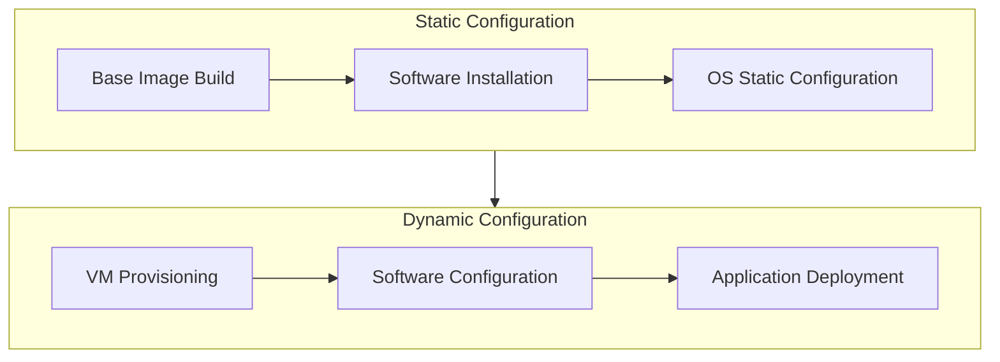

```mermaid
flowchart TD
    subgraph x[Static Configuration]
        direction LR
        A[Base Image Build]
        C[OS Static Configuration]
        B[Software Installation]
        A --> B --> C
    end

    subgraph y[Dynamic Configuration]
        direction LR
        D[VM Provisioning]
        E[Software Configuration]
        F[Application Deployment]
        D --> E --> F 
    end

    x --> y
```
