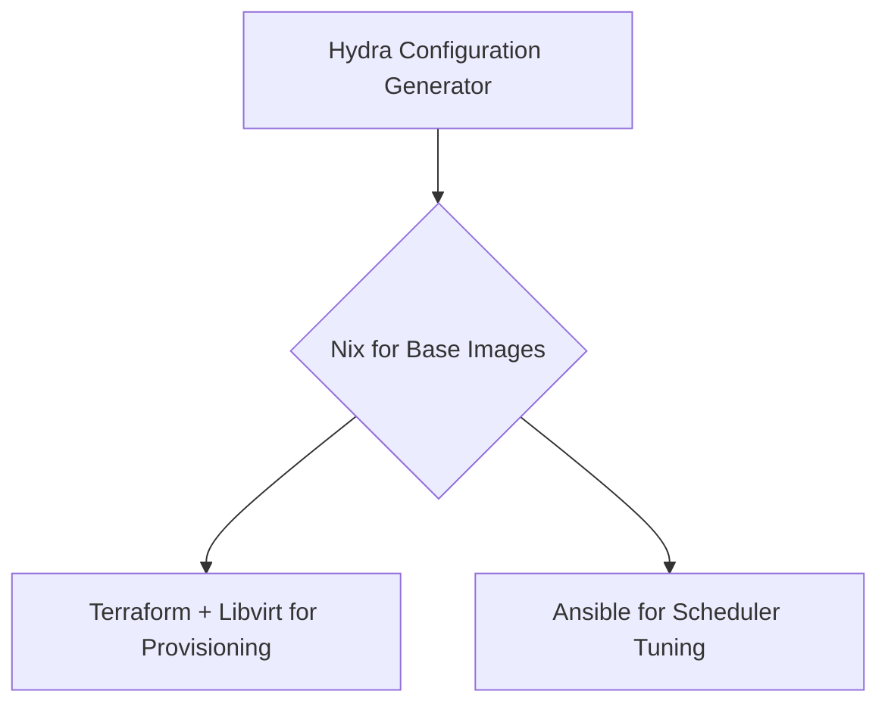

# Comparative Analysis: Terraform/Ansible vs. Nix Approach

## Overview of Both Approaches

| Aspect                     | Terraform + Ansible + Libvirt                     | Nix + Libvirt + Ansible                    |
| -------------------------- | ------------------------------------------------- | ------------------------------------------ |
| **Core Paradigm**          | Separate tools for provisioning and configuration | Unified approach to environment definition |
| **Learning Curve**         | Moderate - familiar industry tools                | Steep - specialized DSL                    |
| **Reproducibility**        | Good                                              | Excellent                                  |
| **Integration with Hydra** | Straightforward                                   | More complex                               |
|                            |                                                   |                                            |

## Detailed Analysis

### 1. Reproducibility & Scientific Validity

**Nix Advantage**: For a benchmarking project where the validity of your results is paramount, Nix offers superior reproducibility guarantees:

- Bit-for-bit reproducible environments
- Precise dependency versioning
- Elimination of "works on my machine" problems
- Perfect for capturing the exact state of each (A,B,C) tuple in your benchmark model

**Terraform/Ansible Challenge**: While Ansible can be deterministic, it doesn't offer the same guarantees about the underlying system state and package versions.

### 2. Learning Curve & Implementation Time

**Terraform/Ansible Advantage**: These tools are:

- More widely used in industry
- Better documented
- Likely more familiar to team members
- Faster to get started with

**Nix Challenge**: The learning curve is significant:

- Specialized language (not Python or YAML)
- Different conceptual model
- Debugging can be challenging
- May add weeks to your initial development time

### 3. Integration with Your Mathematical Framework

**Nix Alignment**: Nix's purely functional approach aligns well with your formal mathematical model:

- Direct mapping between your (A,B,C) tuples and Nix configurations
- Composability mirrors your need to swap components systematically
- Better isolates variables in your experimental design

**Terraform/Ansible Approach**: More pragmatic but less elegant mapping to your mathematical framework.

### 4. Long-term Maintainability

**Nix Advantage**: If this project evolves into a long-term research platform:

- Configurations remain valid indefinitely
- Less configuration drift over time
- Better for archiving exact experimental conditions

**Terraform/Ansible Advantage**: More people can maintain it without specialized knowledge.

## Decision Factors to Consider

1. **Project Timeframe**: If you need results quickly, Terraform+Ansible provides faster implementation.
    
2. **Team Expertise**: Existing Nix knowledge would significantly change this equation.
    
3. **Scientific Rigor Requirements**: How critical is perfect reproducibility to your research goals?
    
4. **Future Plans**: Will this be a one-time study or an ongoing research platform?
    
5. **Publication Plans**: Will reviewers question the validity of results if environments aren't perfectly reproducible?
    

## Recommendation

Given the scientific nature of your benchmarking project and the formal mathematical approach you're taking, I would revise my original recommendation:

**If you can afford the learning curve**, the Nix-based approach will likely yield more scientifically valid results and better align with your mathematical framework. Its guarantees of reproducibility are invaluable for benchmark validity.

**If time constraints are severe**, start with Terraform+Ansible and consider migrating to Nix in a future phase of the project.

A hybrid approach is also possible: start with Terraform for VM provisioning, but use Nix within the VMs to ensure reproducible environments for the actual benchmarks.

---

# Decision Matrix: Terraform/Ansible vs Nix-based Approach

| **Criteria**                 | **Terraform + Ansible**          | **Nix-based Approach**                         | **Project Priority** |
| ---------------------------- | -------------------------------- | ---------------------------------------------- | -------------------- |
| **Reproducibility**          | Good (Declarative TF + Ansible)  | Excellent (Pure functional builds)             | Critical             |
| **Benchmark Consistency**    | Depends on base images           | Atomic, immutable environments                 | Critical             |
| **Learning Curve**           | Moderate (Widely used tools)     | Steep (Nix language, concepts)                 | High                 |
| **Scheduler Configuration**  | Mature (Ansible roles exist)     | Requires custom Nix modules                    | High                 |
| **Hardware Simulation**      | Libvirt via TF provider          | Libvirt + NixOS generators                     | High                 |
| **Parameter Space Coverage** | Requires manual matrix expansion | Native compositionality                        | Critical             |
| **Metrics Correlation**      | Risk of hidden variables         | Exact environment tracking                     | Critical             |
| **Integration Complexity**   | Well-established patterns        | Novel integration with Python/Hydra            | Moderate             |
| **Community Support**        | Large communities                | Growing but niche HPC adoption                 | Moderate             |
| **Security Constraints**     | Works with user-space libvirt    | Requires nix-daemon (check Rhodey permissions) | Critical             |

# Key Tradeoff Analysis

## 1. **Reproducibility vs Operational Simplicity**

- **Nix** provides mathematically pure reproducibility through content-addressable store
- **Terraform/Ansible** offers "good enough" reproducibility but depends on external repos
- _Your Need_: Critical for valid Pareto analysis → Favors Nix

## 2. **Configuration Expressiveness**

- **Nix** enables formal verification of configurations
- **Ansible** offers imperative flexibility
- _Your Workloads_: Need to model (A,B,C) formally → Favors Nix

## 3. **Performance Overhead**

- **Nix** has ~5-10% storage overhead due to isolated environments
- **Terraform** VMs have standard overhead
- _Your Scale_: 128 cores/2TB RAM → Negligible difference

## 4. **Benchmark Variance Control**

- **Nix** eliminates:
    - Hidden package dependencies
    - Transient OS state
    - Undeclared service interactions
- **Terraform/Ansible** requires careful playbook design
- _Your Metrics_: α,β,γ,δ need isolation → Critical for Nix

## 5. **Multi-Objective Optimization Support**

- **Nix** enables:
    - Trivially parallel experiment branches
    - Exact configuration versioning
    - Automated parameter sweeping
- **Traditional Stack** requires manual matrix management
- _Your Goal_: Pareto frontier analysis → Favors Nix

# Risk Analysis

## **Terraform/Ansible Risks**

1. Hidden dependencies skewing metrics
2. Configuration drift between experiments
3. Manual version pinning complexity

## **Nix Risks**

1. Team learning curve delays
2. Integration with existing metrics stack
3. Libvirt permission requirements

# Recommended Decision Path

## **Choose Nix If...**

1. You have ≥2 weeks for team ramp-up
2. Strict scientific reproducibility is non-negotiable
3. Rhodey permits user-space Nix installations
4. You plan long-term maintenance/extension

## **Choose Terraform/Ansible If...**

1. You need immediate results (<1 week setup)
2. Team has existing Ansible/TF expertise
3. Tolerance for potential environment variance
4. Simpler integration with Jupyter/MLflow

# Hybrid Approach Recommendation

Consider a phased implementation:

1. **Use Nix** to create:
    - Base OS images with exact dependency versions
    - Verified scheduler installations (SLURM/Flux/K8s)
    - Benchmark toolchains (HPL, HPCG etc)
2. **Use Terraform** for:
    - VM resource allocation
    - Network topology management
    - Cluster orchestration
3. **Use Ansible** for:
    - Runtime scheduler configuration
    - Benchmark job submission
    - Metrics collection setup

This combines Nix's reproducibility with Terraform/Ansible's operational familiarity.