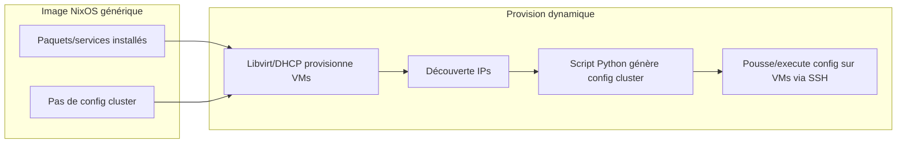

# Gen 1

---
Voici une analyse détaillée des avantages et inconvénients des deux approches (statique vs dynamique) concernant la configuration réseau et notamment la gestion des adresses IP dans ton cas précis. Ensuite, je proposerai une recommandation concrète adaptée à ton contexte.

---

## 📌 Problème actuel résumé :

Actuellement, tu as une configuration statique dans tes modules NixOS comme ceci :

```nix
services.kubernetes.masterAddress = "192.168.222.22";
```

Cela impose :

- De connaître à l'avance l'adresse IP du master.
- De devoir rebuilder une nouvelle image chaque fois que la topologie change (nombre de masters, nombre de workers, etc.).

C'est problématique car :

- Cela limite la flexibilité de tes expériences.
- Cela ajoute une étape manuelle ou semi-automatique (rebuild NixOS image) à chaque changement topologique.

---

## 🟢 Approche 1 : Configuration réseau statique (IP fixes)

### Avantages :
- **Simplicité et prévisibilité** :  
  - Tu connais exactement l'adresse IP de chaque élément du cluster.
  - Facilite la configuration initiale et le troubleshooting réseau.
- **Facilité d'intégration avec NixOS** :  
  - NixOS est conçu pour gérer facilement des configurations déclaratives statiques.

### Inconvénients :
- **Rigidité** :  
  - Chaque modification de topologie (ajout/suppression de nodes, changement de rôles) nécessite une modification explicite de la configuration et un rebuild complet.
- **Scalabilité limitée** :  
  - Difficile à maintenir si le nombre de nodes devient important ou change souvent.
- **Risque de conflits IP** :  
  - Nécessite une gestion stricte des adresses IP.

---

## 🔵 Approche 2 : Configuration réseau dynamique (DHCP uniquement)

### Avantages :
- **Flexibilité maximale** :  
  - Ajoute ou supprime des nodes sans rebuild d'image.
  - Facilite les expérimentations rapides et variées.
- **Scalabilité** :  
  - La gestion dynamique permet de facilement déployer des clusters de tailles variées sans contraintes de configuration statique.
- **Automatisation simplifiée** :  
  - En découplant complètement la configuration réseau de la construction des images, tu peux automatiser la configuration post-déploiement à partir de Python ou d'autres outils comme Ansible.

### Inconvénients :
- **Complexité accrue en post-provisioning** :  
  - Tu dois implémenter une couche supplémentaire au-dessus (Python, Ansible, scripts SSH) pour découvrir les IP dynamiques après démarrage.
- **Dépendances sur le DHCP et DNS** :  
  - Si le DHCP tombe en panne ou se comporte mal, ton système devient instable ou difficile à diagnostiquer.
- **Configuration Kubernetes plus complexe** :  
  - Kubernetes nécessite que chaque node connaisse l'adresse du master. En DHCP pur, tu devras donc implémenter une phase de découverte dynamique des IP du master (par exemple via une API externe, un fichier partagé, ou SSH).

---

## 🔍 Analyse critique pour ton cas précis :

Tu as précisé que tu souhaites une infrastructure :

- **Flexible** (topologies variables : 1, 2, 3 masters, nombre de workers variable)
- **Automatisée** (le moins de rebuild possible)
- **Reproductible** (expériences facilement répétables)

Dans ce contexte, l'approche purement statique (IP fixe dans NixOS) semble clairement sous-optimale, car :

- Elle impose trop de rebuilds et de gestion manuelle.
- Elle est contraire à l'esprit de flexibilité et d'automatisation que tu recherches.

En revanche, une approche purement dynamique (DHCP) est plus adaptée à tes besoins, à condition d'ajouter une couche de configuration dynamique post-provisionnement.

---

## ✅ Recommandation concrète :

Je recommande fortement l'approche suivante, qui est un compromis efficace :

1. **Phase NixOS (Image Build)** :  
   - **Ne configure PAS les IP fixes** dans les modules NixOS. Garde uniquement :
     - Installation des paquets (kubernetes, kubeadm, kubelet, kubectl).
     - Configuration des firewalls et des ports nécessaires.
     - Configuration réseau minimale (DHCP activé, DNS fonctionnel).

   Exemple simplifié NixOS (sans IP fixe) :
   
   ```nix
   services.kubernetes = {
     roles = ["master"];
     easyCerts = true;
     addons.dns.enable = true;
   };
   
   networking.useDHCP = true;
   ```

2. **Phase Dynamique (Post-Provisioning avec Python)** :  
   - Après provisionnement via libvirt (Python wrapper), récupère dynamiquement l'adresse IP attribuée par DHCP via libvirt API (ce que tu fais déjà).
   - Connecte-toi via SSH (avec paramiko) pour exécuter les commandes nécessaires à la configuration dynamique :
     - Pour le master : `kubeadm init --apiserver-advertise-address=<IP récupérée dynamiquement>`
     - Pour les workers : `kubeadm join <IP dynamique du master>`

   Exemple Python simplifié :
   
   ```python
   master_ip = provisioner.provision_node(master_node)
   join_command = provisioner.ssh_execute(master_ip, f"sudo kubeadm init --apiserver-advertise-address={master_ip} --pod-network-cidr=10.244.0.0/16 | grep 'kubeadm join' -A1")
   
   for worker_node in worker_nodes:
       worker_ip = provisioner.provision_node(worker_node)
       provisioner.ssh_execute(worker_ip, f"sudo {join_command}")
   ```

3. **Optionnel (DNS interne dynamique)** :  
   - Si tu veux simplifier davantage, configure dnsmasq dans ton réseau libvirt pour associer automatiquement les noms d'hôtes aux IP attribuées par DHCP. Ainsi, tu peux utiliser des noms DNS internes (`master.cluster.local`) plutôt que des IP.

---

## ⚠️ Points d'attention pour l'approche recommandée :

- **Fiabilité DHCP** :  
  Vérifie que ton réseau DHCP/dnsmasq libvirt est stable et robuste (testé, monitoré).
  
- **Découverte dynamique** :  
  Assure-toi que ta méthode d'obtention des IP via libvirt est robuste. Envisage de gérer les cas d'erreurs (timeout, retry, etc.).

- **Reproductibilité** :  
  Documente clairement la procédure dynamique et les scripts Python utilisés pour garantir la reproductibilité complète.

---

## 🎯 Conclusion :

Pour ton cas précis (benchmarking flexible et automatisé avec topologies variables), **une configuration réseau dynamique est clairement préférable**. 

- Ne configure pas les IP statiquement dans tes images NixOS.
- Utilise DHCP et ajoute une couche dynamique en Python après provisionnement pour configurer Kubernetes.

Cela te donnera la flexibilité, l'automatisation et la reproductibilité dont tu as besoin.

---

# Gen 2

---

Tu es face à un problème classique dans l'automatisation des infrastructures virtuelles : le choix entre une configuration réseau statique ou dynamique (DHCP). Voici une analyse structurée pour t'aider à prendre une décision éclairée, en lien direct avec ton cas d'utilisation détaillé.

---

## 🔍 Analyse du problème actuel

Actuellement, tu définis un `masterIP` statique dans ta configuration NixOS pour Kubernetes :

```nix
services.kubernetes.masterAddress = "192.168.222.22";
```

Cela pose les problèmes suivants :

- **Rigidité** : Chaque topologie différente (nombre de masters, nombre de workers) nécessite de modifier la configuration statique NixOS et de rebuilder l'image.  
- **Manque de flexibilité** : Impossibilité de provisionner dynamiquement plusieurs clusters avec des topologies différentes sans intervention manuelle sur les fichiers Nix.
- **Difficulté de scale** : Dès que tu veux tester plusieurs configurations rapidement, cela devient contraignant car tu dois rebuilder des images à chaque fois.

---

## 📌 Objectifs clés à atteindre

Rappelons tes objectifs clés pour ce benchmark :

- **Flexibilité maximale** : pouvoir changer facilement la topologie (nombre de master/workers) sans devoir rebuilder l'image.
- **Automatisation complète** : éviter les interventions manuelles répétitives.
- **Reproductibilité & fiabilité** : garder les expériences reproductibles avec Hydra et Nix flakes.
- **Simplicité opérationnelle** : minimiser les dépendances entre les composants (NixOS, Hydra, Python).

---

## 🚦 Deux approches possibles

Tu as identifié deux grandes approches :

### ① Configuration réseau statique (IP fixes définies dans Nix)

- Chaque VM a une adresse IP prédéfinie.
- Kubernetes et les autres schedulers connaissent les IP à l'avance via la configuration Nix.

#### ✅ Avantages :

- Simplicité initiale : configuration explicite, claire et facile à comprendre.
- Facilité de débogage : les IP fixes facilitent l'identification et la résolution des problèmes réseau.
- Pas de dépendance sur un mécanisme de découverte dynamique après le boot.

#### ❌ Inconvénients :

- Très peu flexible : chaque changement de topologie nécessite de rebuilder l'image Nix.
- Lourdeur opérationnelle : difficile à maintenir à mesure que les expériences évoluent.
- Risque d'erreurs humaines : chaque changement manuel augmente le risque d'erreur.

---

### ② Configuration réseau dynamique (DHCP + configuration dynamique après boot)

- Toutes les VM obtiennent leur IP via DHCP.
- Après le provisionnement, un script Python (ou autre) configure dynamiquement Kubernetes (ou autre scheduler) en découvrant les IP attribuées.

#### ✅ Avantages :

- Flexibilité maximale : aucune modification nécessaire dans les images Nix pour changer la topologie.
- Automatisation complète : la topologie est définie entièrement dans Hydra et Python, pas dans les images.
- Scalabilité : très facile d'ajouter ou supprimer des nœuds dynamiquement.
- Meilleure séparation des responsabilités : Nix ne gère que les dépendances statiques, Python/Hydra gèrent la configuration dynamique.

#### ❌ Inconvénients :

- Complexité supplémentaire : nécessite une étape de découverte dynamique après le boot.
- Dépendance sur DHCP : les IP peuvent potentiellement changer, il faut gérer les baux DHCP correctement.
- Nécessite une logique de gestion de configuration dynamique robuste (ex: scripts Python avec SSH ou outils type Ansible).

---

## 🧠 Recommandation argumentée

**Compte tenu de ton contexte (benchmarking de schedulers HPC avec différentes topologies et configurations fréquentes), l'approche dynamique (DHCP + configuration dynamique après boot) est nettement préférable.**

Pourquoi ?

- **Fréquence élevée de changements de topologie** :  
  Tu vas forcément vouloir tester différentes configurations (1 master, 2 master, 3 master, plus ou moins de workers). Une approche statique te ralentira énormément, car chaque changement nécessite un rebuild Nix.

- **Automatisation complète et reproductibilité** :  
  Avec une approche dynamique, tu peux définir toute ta topologie dans Hydra (`config.yaml`) et utiliser ton code Python existant pour automatiser entièrement le provisionnement et la configuration après boot.

- **Séparation claire des responsabilités** :  
  - Nix : gère uniquement les dépendances et l'installation logicielle (Kubernetes, Flux, Slurm, etc.).
  - Python/Hydra : gère la configuration dynamique (IP, topologie, configuration scheduler).

- **Facilité d'évolution future** :  
  Si tu veux ajouter d'autres schedulers ou d'autres workloads, cela sera beaucoup plus simple avec une approche dynamique.

---

## 🚧 Comment implémenter concrètement l'approche dynamique ?

Voici une stratégie claire et éprouvée :

### Étape 1 : Simplifier la configuration Nix

- Supprime toute référence à des IP fixes dans tes fichiers Nix (`masterAddress`, etc.).
- Configure uniquement les dépendances logicielles (ex: installation Kubernetes, kubeadm, kubelet, etc.) sans aucune configuration d'IP fixe.

Exemple simplifié de `master.nix` :

```nix
{ config, pkgs, lib, ... }:
{
  environment.systemPackages = with pkgs; [
    kubectl
    kubeadm
    kubelet
  ];

  services.kubernetes.roles = ["master"];
  services.kubernetes.easyCerts = true;

  networking.useDHCP = true;

  networking.firewall.enable = true;
  networking.firewall.allowedTCPPorts = [22 6443 2379 2380 10250 10251 10252];
}
```

### Étape 2 : Découverte dynamique des IP après provisionnement

- Ton script Python (déjà existant) récupère les IP après provisionnement via Libvirt.
- Tu peux utiliser SSH (via Paramiko) pour exécuter dynamiquement les commandes de configuration Kubernetes après que les IP soient connues.

Exemple simplifié de workflow Python :

```python
# provision master
master_ip = provisioner.provision_node(master_config)

# configure master dynamically
join_command = provisioner.ssh_execute(master_ip, "sudo kubeadm init --apiserver-advertise-address=$(hostname -I | awk '{print $1}') --pod-network-cidr=10.244.0.0/16 | grep 'kubeadm join' -A1")

# provision workers
for worker_config in worker_configs:
    worker_ip = provisioner.provision_node(worker_config)
    provisioner.ssh_execute(worker_ip, f"sudo {join_command}")
```

### Étape 3 : Gestion des baux DHCP

- Configure ton serveur DHCP (libvirt dnsmasq) pour des baux DHCP suffisamment longs pour éviter des changements intempestifs d'IP.
- Alternativement, utilise des réservations DHCP basées sur les adresses MAC virtuelles si tu veux une stabilité absolue des IP tout en conservant la flexibilité.

---

## 🚩 Conclusion finale

✔️ **Choisis l'approche dynamique (DHCP + configuration dynamique après boot)**  
✔️ **Supprime les IP fixes de ta configuration Nix**  
✔️ **Utilise ton code Python/Hydra existant pour gérer dynamiquement la configuration après le provisionnement**

Cette approche répondra parfaitement à tes besoins de flexibilité, automatisation, reproductibilité et évolutivité pour ton projet de benchmarking HPC.

---

# Gen 3

---

Excellente question, très courante dans l’automatisation d’infrastructures HPC et cloud : **où placer la frontière entre configuration statique (bake-time, dans l’image) et dynamique (run-time, après le boot, via DHCP/discovery/scripting)**, en particulier pour la configuration réseau (et donc l’adressage des services comme `kubernetes.masterAddress`).

## 1. **Résumé de la situation**

- **Actuel** : L’adresse du master Kubernetes (`masterAddress`) est codée en dur dans le module Nix. Or, avec DHCP, l’IP n’est pas garantie — ce qui rend la config fragile, peu flexible, et peu compatible avec la variation de topologies.
- **Besoin** : Pouvoir provisionner des clusters **dynamiquement** (nombre de masters/workers variable, changement de topologie) **sans rebuild d’image** à chaque variation.
- **Problème** : Nix veut tout connaître à l’avance (statique), alors que DHCP et la découverte dynamique sont faites pour l’infrastructure flexible.

## 2. **Avantages/Inconvénients des deux approches**

### A. **Configuration réseau statique (IP fixes dans Nix)**

#### **Avantages**
- **Prévisibilité** : On sait à l’avance qui aura quelle IP, donc tous les services (K8s, SLURM, etc.) peuvent être configurés statiquement dès le build.
- **Pas besoin de discovery dynamique** : Pas de scripts à exécuter post-boot pour « patcher » la config.
- **Peut être plus simple pour des déploiements très figés**.

#### **Inconvénients**
- **Rigidité** : Toute modification de topologie (ajout/suppression de nœuds) implique de rebuild toutes les images avec la nouvelle config.
- **Gestion manuelle** : Il faut s’assurer qu’il n’y a pas de conflits IP, et maintenir la cohérence entre la config Nix, Hydra, et la réalité du réseau.
- **Pas compatible avec le scaling automatique ou la variation rapide de clusters**.

### B. **Configuration réseau dynamique (DHCP, discovery, post-provisioning config)**

#### **Avantages**
- **Flexibilité extrême** : On peut lancer n’importe quelle topologie, changer le nombre de nœuds, sans rebuild d’image.
- **Reproductibilité** : L’image de base est la même pour tous, seules les configs runtime changent.
- **Automatisation facile** : On peut générer les configs à la volée en Python (ou autre), injecter la bonne IP du master dans les workers, etc.

#### **Inconvénients**
- **Un peu plus complexe** : Il faut un mécanisme pour découvrir les IPs attribuées par DHCP (par exemple via libvirt, ou en scannant le réseau), puis patcher les configs (via SSH, Ansible, cloud-init, ou autre).
- **NixOS module limitations** : Certains services NixOS ne supportent pas de « reconfiguration » à chaud sans rebuild, donc il faut que la config soit « générique » et patchée au boot (par exemple via un script systemd ou cloud-init).

## 3. **Ce qui est recommandé dans ton contexte (benchmarks dynamiques)**

Tu veux :

- **Supporter des clusters à topologie variable** sans rebuild d’image.
- **Automatiser** le provisionnement et la configuration.
- **Rendre la stack reproductible** mais flexible.

**→ Il faut donc privilégier une approche « image générique + configuration dynamique post-provisioning ».**

### **Comment faire concrètement ?**

1. **Images NixOS génériques**
   - Le module Nix ne doit pas fixer d’IP statique ni de `masterAddress`.
   - Il doit installer les paquets/services nécessaires, mais laisser la configuration finale (join, masterAddress, etc.) à un script d’initialisation.
   - Exemple : un service systemd `k8s-init.service` qui attend qu’un fichier `/etc/k8s/master-ip` soit présent, puis configure kubelet/kubeadm à la volée.

2. **Provisionnement Python (Hydra/libvirt)**
   - Après le boot, ton orchestrateur découvre l’IP de chaque VM (via libvirt, DHCP lease, ou scan).
   - Il choisit le master, collecte son IP, puis configure les workers pour rejoindre ce master (par SSH, ou en copiant un fichier de config, ou en lançant un script distant).
   - Pour SLURM ou Flux, même logique : la config du cluster (`slurm.conf`, etc.) est générée dynamiquement puis poussée sur les nœuds.

3. **Injection de configuration**
   - Par SSH (comme tu fais déjà avec Paramiko), ou via un script cloud-init, ou en montant un volume partagé temporaire avec la config.
   - Tu peux aussi utiliser un « userdata » ou un service systemd qui, au boot, attend une config depuis l’orchestrateur.

## 4. **Exemple de workflow (Kubernetes)**

1. **Build image générique** : Nix installe kubeadm/kubelet, mais ne configure pas `masterAddress`.
2. **Provisionne les VMs via libvirt** (DHCP).
3. **Découvre les IPs** (libvirt, DHCP lease).
4. **Initialise le master** (via SSH : `kubeadm init ...`).
5. **Récupère le join-token** (SSH sur le master).
6. **Configure les workers** (SSH sur chaque worker pour exécuter `kubeadm join ...` avec l’IP du master).
7. **Optionnel** : Patch les fichiers de config (kubeconfig, etc.) pour refléter la topologie réelle.

## 5. **Et pour NixOS modules/services ?**

- **Soit** tu fais des modules Nix très « généraux » qui acceptent d’être reconfigurés post-boot (par exemple, un service qui attend une config dans `/etc/cluster.conf` et la recharge).
- **Soit** tu ne mets dans Nix que l’installation des paquets/services, et la vraie config est injectée à chaud.

## 6. **Résumé de la recommandation**

- **Évite de fixer les IPs ou la config cluster dans Nix** si tu veux de la flexibilité.
- **Utilise DHCP partout** et découvre les IPs via ton orchestrateur.
- **Génère et pousse la configuration cluster (K8s, SLURM, etc.) après le boot**, via SSH/SCP ou scripts.
- **Option avancée** : utilise cloud-init ou des hooks systemd pour attendre la config à chaud.

**C’est ce que font la plupart des outils cloud (OpenStack, AWS, GCP) et les orchestrateurs modernes.**

---

## 7. **Pour aller plus loin**

- **Pour NixOS** : tu peux avoir un service systemd qui attend une config (par exemple, `/etc/k8s/master-ip`) et qui lance le join/init quand elle apparaît.
- **Pour la reproductibilité** : versionne tes scripts Python de configuration, et garde une trace des IPs/topologies de chaque run.
- **Pour la flexibilité** : tu peux même déployer plusieurs clusters sur le même réseau sans conflit.

---

## 8. **Conclusion**

**Pour un banc d’essai HPC dynamique et automatisé, la solution la plus propre est :**

- **Image NixOS générique (paquets/services installés, pas de config cluster)**
- **DHCP partout**
- **Configuration dynamique des services cluster (K8s, SLURM, Flux) par script Python post-provisioning (via SSH/SCP)**
- **Pas de rebuild d’image à chaque topologie**

**Tu ne perds rien en robustesse, tu gagnes énormément en agilité.**

---

### **Schéma rapide**



---

## **TL;DR**

> **Utilise DHCP partout, images NixOS génériques, et pousse la config cluster (master IP, worker join, etc.) dynamiquement via ton orchestrateur Python après le boot.**  
>  
> **N’encode pas l’IP du master dans Nix.**  
>  
> **C’est la seule façon propre de supporter des clusters dynamiques, reproductibles et flexibles pour tes benchmarks.**

---

Si tu veux un exemple de code pour un service NixOS qui attend une config à chaud, ou un exemple de script Python pour « patcher » les configs cluster, demande-moi !