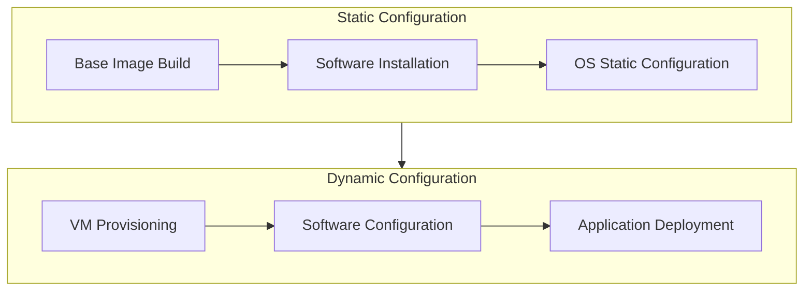

# Benchmark Specification: Multi-Objective Comparison of HPC Schedulers

## Problem Definition

This project aims to benchmark and compare multiple HPC schedulers across different hardware and software environments. Given a benchmark function:$$F: \left(A,B,C\right) \rightarrow \left(\alpha,\beta,\gamma,\delta \right)$$composed of a virtual cluster $A$ that's running a workload $C$ on a given a Scheduler $B$ and output a set of metrics $O =\{\alpha,\beta,\gamma,\delta \}$ defined in the Output space definition section. We'll explore and analyze the Pareto space related to $O$, identifying optimal trade-offs among $O$.

## Research Question

> How do SLURM, Kubernetes+Volcano, and Flux Framework schedulers compare in terms of resource utilization ($\alpha$), fairness ($\beta$), job completion time ($\gamma$), and elasticity ($\delta$) across varying HPC workloads and hardware configurations in the sense of Pareto?

## Input Space Definition

The input space $(A,B,C)$ consist of:
### Virtual Cluster $A$

- Defines the cluster architecture, including the number and type of head and worker nodes.
- Defines the VM node's hardware profiles (# of CPUs,  # of GB RAM, Disk Space, and network characteristics)

### Scheduler Systems $B$

The schedulers under evaluation represent distinct approaches to workload management in HPC:

1. SLURM: $b_1$
2. Kubernetes + Volcano : $b_2$
3. Flux Framework: $b_3$

### Workload Types $C$

The benchmark $F$ will be composed of :

- HPL (High-Performance Linpack): Stresses CPU floating-point capabilities
- HPCG (High-Performance Conjugate Gradient): Exercises memory hierarchy and interconnect
Additional workloads may be incorporated in future iterations.

## Output Space Definition

The following metrics will be used for evaluation:

- **Resource Utilization ($\alpha$)**:
  Measures the extent to which available resources (e.g., CPU, memory, network bandwidth) are employed. Higher utilization indicates more efficient use of resources, while underutilization suggests waste.

- **Fairness ($\beta$)**:
  Assesses the equitable distribution of resources among users or workloads. Finish-time fairness, for instance, compares completion time in a shared environment versus alone, ensuring no single workload monopolizes resources.

- **Job Completion Time ($\gamma$)**:
  Encompasses the entire duration required for a job to finish—queueing, execution, and teardown. Particularly important in multi-node HPC environments, where parallel processing can drastically reduce total completion time.

- **Elasticity ($\delta$)**:
  Evaluate how well the scheduler can adapt to fluctuating workloads by scaling resources up or down. Efficient elasticity ensures workload demands are met while preventing resource bottlenecks or waste.

## Methodology

The benchmarking experiments follow three distinct conceptual phases:

### Experiment Design

- Clearly define the input space (A,B,C) configurations to evaluate.
- Identify the relevant metrics (α,β,γ,δ) to measure.
- Define the experimental plan (number of repetitions, statistical significance criteria).
### Experiment Execution

- Automatically provision virtual clusters $A$ for each scheduler $B$.
- Execute workloads $C$ on each scheduler $B$ and cluster configuration $A$.
- Collect and store metrics data $O$
### Analysis and Interpretation

- For each tuple $(A,B,C)$ explore the Pareto frontier representation of $O$.
- Visualize trade-offs across metrics.
- Identify bottlenecks, strengths, and weaknesses of each scheduler.
- Derive actionable guidelines for selecting schedulers based on workload types and hardware configurations.

## Experiment Architecture

Provisioning a virtual cluster with a dynamic configuration for wide ranges of experimentation requires reproducibility, flexibility, and strong automation capabilities in a holistic approach. The configuration is separated into declarative OS as Code and Infrastructure as code configuration, and the dynamic runtime parameters are handled after provisioning for different configurations.

The first step is to build a static OS image with all required software and toolchains installed. As the parameters evolve from different experiments, they should be configured after provisioning, such as IP address and hostnames that depend on the configuration.

These approaches encompass the following principles:

- **Declarative Infrastructure**: All infrastructure components (VMs, networks, schedulers) are defined declaratively using Hydra and Nix flakes to ensure reproducibility.
- **Automated Provisioning**: The provisioning workflow automatically builds deterministic VM images and provisions them onto the target infrastructure using a libvirt-based Python wrapper.
- **Flexible and Extensible Architecture**: The provisioning system is designed to easily accommodate future expansions in cluster size, additional schedulers, or new workload types.
- **Observability and Reliability**: Ensure robust logging, monitoring, and error handling.

Therefore, the following components have been designed:
### Configuration System

The infrastructure configuration uses Hydra to manage complex, hierarchical configurations. In order to be configurable, the configuration should define composable data classes to model the configuration. define input space $(A,B,C)$

- `HPCConfig` that encompasses the whole topology $A$
- `ClusterConfig` that encompasses the name of the cluster and the number of head and worker nodes
- `NodeConfig` that encompasses the name, resources, network config, user config, disk_size, scheduler config, and image of a node
- `SchedulerConfig` that encompasses the scheduler $B$
- `UserConfig` that includes all user settings
- `NetworkConfig` that includes the network config
- `Resource` that includes the physical resource that could be (RAM, CPU, GPU, LPU, DISK)

### Libvirt Python Wrapper

This component wraps Libvirt python bindings and handles the SSH connection to tie the Configuration system with the Libvirt ecosystem. It offers SSH capabilities in order to run the commands on `rhodey.`

### Image Builder

Build deterministic base images for different scheduler-specific roles. 

The infrastructure provisioning system leverages Nix flakes to ensure reproducibility, deterministic builds, and simplified dependency management. The flakes approach allows the definition of a single, reproducible entry point for building VM images and configuring scheduler static environments.

**Nix Flakes Structure:**

- **Base VM Flake**: Defines a minimal NixOS VM image configuration shared across all virtual machines (common packages, kernel settings, SSH keys, etc.).
- **Scheduler-Specific Flakes**: Extends the base VM flake to create specialized configurations for each scheduler type:
    - `slurm-head.nix`: Configuration specific to a SLURM head node.
    - `slurm-worker.nix`: Configuration specific to a SLURM worker node.
    - `k8s-head.nix`: Configuration specific to a Kubernetes+Volcano head node.
    - `k8s-worker.nix`: Configuration specific to a Kubernetes+Volcano worker node.
    - `flux-head.nix`: Configuration specific to a Flux Framework head node.
    - `flux-worker.nix`: Configuration specific to a Flux Framework worker node.

### VM Provisioner

Interpret configurations and manage the provisioning workflow.

This component leverages the Python-based libvirt wrapper to instantiate virtual machines from the builder and automatically configure VM resources (CPU, RAM, disk, network) based on predefined Hydra configurations. Handle the actual resource creation from a `qcow2` image.

Automatically configure schedulers (SLURM, Kubernetes+Volcano, Flux) based on the provisioned VMs. Ensure scheduler-specific configurations are applied consistently to head and worker nodes.

### Network Configuration

- **Cluster Network Isolation:**  
    Network isolation is achieved by running only one virtual cluster at a time. All VMs for a cluster are attached to a dedicated libvirt network (`scheduler_benchmark_net`), which is reused between experiments.
- **Virtual Switch:**  
    A single libvirt network, backed by a bridge (`virbr2`), provides switching, NAT, DHCP, and DNS for all VMs in a cluster.
- **IP Assignment:**  
    All VMs obtain their IP addresses via DHCP from the libvirt network. The orchestration layer discovers the assigned IPs after boot and configures scheduler components (e.g., master/worker relationships) at runtime using SSH.
- **DNS:**  
    DNS is provided by the libvirt network's built-in dnsmasq service. Internal hostnames can be resolved if configured in the network XML, but most scheduler configuration uses IP addresses.
- **Network Automation:**  
    The network is set up manually; future work may automate network creation and teardown for full reproducibility.
- **Bandwidth/Latency Constraints:**  
    No network performance emulation is performed; all VMs share the host's physical network bandwidth and latency.

### Requirements

#### Functional requirements

- Automated Image Building: The system must build reproducible NixOS base images with different configurations.
- Automated Provisioning: The system must provision virtual clusters without manual intervention.
- Topology Flexibility: Support for multiple predefined cluster topologies (small, medium, large) with varying numbers of head and compute nodes.
- Resource Configuration: Ability to specify CPU, memory, disk, and network configurations for each node type.
- Network Configuration: Creating isolated networks for each cluster with appropriate routing and DNS.
- Idempotency: Ensure provisioning operations are idempotent to support retries and incremental changes.
- Cleanup: Provide mechanisms to tear down provisioned resources after experiments completely.
- Speed: Use pre-built base images to accelerate provisioning with minimal runtime configuration.

#### Non-functional requirements

- Reproducibility: Experiments must be fully reproducible through versioned configurations and base images.
- Reliability: The provisioning process should be robust against transient failures.
- Observability: Provide detailed logging and status information during the provisioning process.
- Documentation: All experiment configurations should be self-documenting through code.

## Hardware Resource

### Rhodey (Compute Server)

The benchmark $F$ will be executed on `rhodey,` a Lawrence Berkeley National Laboratory server mirroring a Perlmutter node's CPU topology.

- 2x [AMD EPYC 7763](https://www.amd.com/en/products/cpu/amd-epyc-7763) (Milan) CPUs, 64 cores per CPU
- 512 GB of DDR4 memory total
- 1x [HPE Slingshot 11](https://www.hpe.com/us/en/compute/hpc/slingshot-interconnect.html) NIC
- PCIe 4.0 NIC-CPU connection
- 4 NUMA domains per socket (NPS=4)

### X1-Carbon (Orchestration Machine)

Laptop used for orchestration, provisioning, and experiment management:

- CPU: Intel Core i7 (8th Gen)
- GPU: Intel UHD Graphics 620
- Memory: 16 GiB RAM
- OS: Arch Linux x86_64